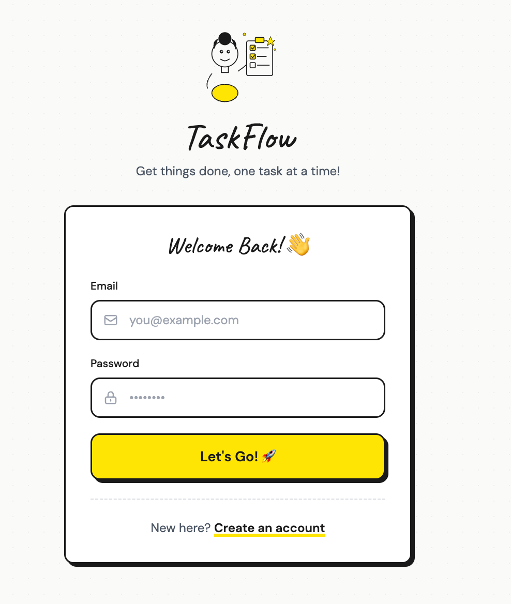

<

**Steps:**
1. Click **"Create an account"** on the login page
2. Enter your **name**
3. Enter your **email**
4. Create a **password** (at least 6 characters)
5. **Confirm** your password
6. Click **"Create Account"**

That's it — you're in! 🎉

---

## 2. Log In

**Steps:**
1. Enter your **email**
2. Enter your **password**
3. Click **"Let's Go!"** 🚀

> 💡 **Forgot your password?** Contact support to reset it.

---

## 3. Your Dashboard

This is your home base! Here you can:

- ✅ See all your tasks
- 📊 Track your progress with the completion bar
- 🔍 Filter tasks by status

**Filter Options:**
| Button | Shows |
|--------|-------|
| **All Tasks** | Everything |
| **Pending** | Tasks not yet done |
| **Done** | Completed tasks |

---

## 4. Add a New Task

**Steps:**
1. Click the **"+ New Task"** button
2. Fill in the task form:

| Field | What to Enter |
|-------|---------------|
| **Title** | What needs to be done (required) |
| **Description** | More details (optional) |
| **Priority** | Low, Medium, or High |
| **Due Date** | When it's due (optional) |

3. Click **"Create Task"**

Your new task appears on the dashboard! ✨

---

## 5. Complete a Task

**To mark a task as done:**
- Click the **checkbox** on the left side of the task

The task will show as completed with a checkmark! ✅

**To undo:**
- Click the checkbox again to mark it as pending

---

## 6. Edit a Task

**Steps:**
1. Find the task you want to edit
2. Click the **pencil icon** ✏️
3. Make your changes
4. Click **"Save Changes"**

---

## 7. Delete a Task

**Steps:**
1. Find the task you want to delete
2. Click the **trash icon** 🗑️
3. Confirm when asked

⚠️ **Warning:** Deleted tasks cannot be recovered!

---

## 8. Sign Out

When you're done:
1. Click **"Sign Out"** in the top-right corner
2. You'll return to the login page

---

## Quick Tips

| Tip | Description |
|-----|-------------|
| 🔴 **High Priority** | Red badge — do these first! |
| 🟡 **Medium Priority** | Yellow badge — important but not urgent |
| 🟢 **Low Priority** | Green badge — do when you have time |
| ⏰ **Overdue** | Tasks past their due date show a warning |

---

## Need Help?

- 📖 Check the [README](../README.md) for technical details
- 🐛 Found a bug? [Report it on GitHub](https://github.com/olegsaveliev/taskflow/issues)

---

**Happy tasking!** 🚀
]]>